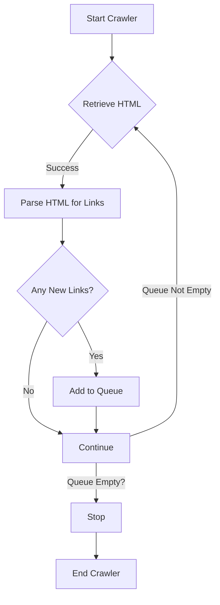

# Web Crawler Project

This project contains a Python script for a simple web crawler that extracts links from a given website and recursively visits each link. It is built using Python's `requests` and `BeautifulSoup` libraries.

## Features

- Fetches HTML content from a specified URL.
- Parses the HTML to extract all links.
- Recursively visits each link to continue the crawl.
- Tracks visited URLs to prevent re-crawling the same page.
- Uses a queue to manage URLs to be crawled.

## Workflow Diagram



## Installation

To run this web crawler, you need Python installed on your system along with the following Python packages:

```bash
pip install requests beautifulsoup4
```

## Usage

Modify the `initial_url` in the script to point to the website you want to start the crawl from. To run the script, simply execute:

```bash
python wcrawler.py
```

The script will print out the list of URLs visited during the crawl.

## Limitations

- The crawler does not handle JavaScript.
- It only fetches and processes 'a' tags for URLs.
- Performance may degrade with a large number of URLs due to the single-threaded nature of the script.

For contributions or issues, please open a pull request or an issue in this repository.


